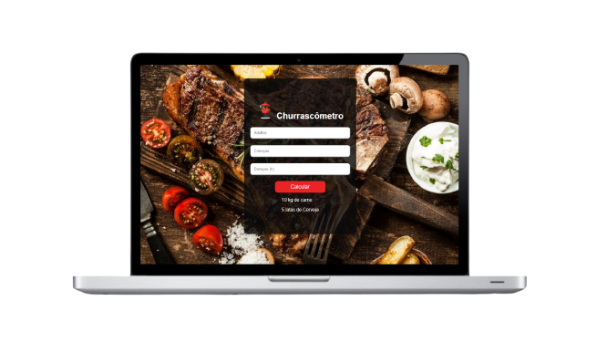

<h1  align="center">
    
    Churrascômetro
</h1>

## 💻 Projeto

**Churrascômetro** é um aplicação Web para saber qual a quantidade certa de alimentos que devem ser levados para um churrasco como por exemplo carne, cerveja e outras bebidas para o seu churrasco.


<h1 align="center">
    
</h1>

## Tecnologias

Este projeto foi desenvolvido com as seguintes tecnologias:

-   [HTML][HTML]
-   [CSS][CSS]
-   [JAVASCRIPT][JAVASCRIPT]


## Como Executar

Para clonar e executar este aplicativo,
execute os seguintes comando.

1. Faça um clone do repositório:

```sh
  $ git clone https://github.com/Djaysson/Churrascometro.git
```

2. Executando a Aplicação:

```sh
  # entre na pasta
  $ cd Churrascometro
  # click no index.html
  $ index.html
  
```


[HTML]: https://developer.mozilla.org/pt-BR/docs/Web/HTML
[CSS]: https://developer.mozilla.org/pt-BR/docs/Web/CSS
[JAVASCRIPT]: https://developer.mozilla.org/pt-BR/docs/Web/JavaScript

